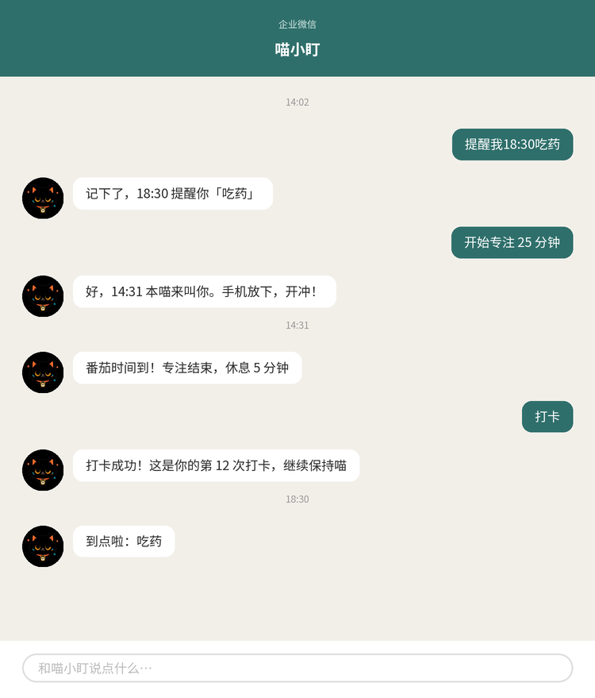
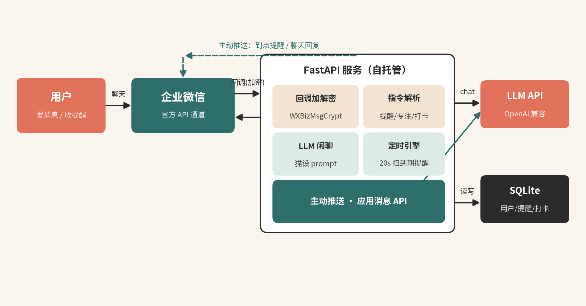

<p align="center">
  
</p>

# OpenCATO 🐱

> 一只住在企业微信里的 AI 提醒猫 —— 看到「微信里的提醒猫」这类付费项目后，想开源学习一下它是怎么做的，于是有了这个从企业微信合规通道、定时提醒引擎到猫设 prompt 的完整独立实现。

[](LICENSE)
[](https://www.python.org/)
[](https://fastapi.tiangolo.com/)
[](CONTRIBUTING.md)

**English**: An open-source AI reminder cat living in WeCom (Enterprise WeChat) — schedule reminders, Pomodoro focus timer, daily check-ins and LLM companionship through the official WeCom API. Built for learning how "a cat living in your chat app" products actually work.

## 这是什么


市面上出现了「住在微信里的小猫」一类的付费订阅产品（计划整理 + 定时督促 + 专注计时 + 打卡陪伴）。OpenCATO 是一个**学习性质的开源复刻**：把这类产品拆解为可自托管的最小实现，代码全部独立编写，MIT 协议，供想研究「AI 陪伴 + 消息提醒」产品形态的同学参考。

关键词：企业微信机器人 / WeCom bot / 微信提醒猫 / AI 伴侣 / LLM 应用 / 定时提醒 / 番茄钟 / 打卡 / FastAPI / SQLite

## 功能特性

- 💬 **AI 聊天陪伴**：LLM 驱动，猫设 prompt 见 [`prompts/cat.md`](prompts/cat.md)（本项目的灵魂，欢迎调教）
- ⏰ **自然语言定时提醒**：`提醒我 18:30 吃药` / `明天早上8点提醒我开会` / `30分钟后提醒我喝水`
- 🍅 **专注计时（番茄钟）**：`开始专注 25 分钟`，到点猫来叫你
- ✅ **每日打卡**：`打卡`，记录累计天数
- 📋 **计划查看**：`计划`，列出待触发的提醒
- 🔒 **合规通道**：只使用企业微信官方 API，主动推送走应用消息，不碰个人号协议

## 效果预览

<p align="center">
  
</p>

## 为什么是企业微信（WeCom）

个人微信协议机器人会被封号且连坐收款账户。企业微信自建应用是官方合规通道，支持服务端**主动推送应用消息**——这是"猫主动来戳你"能合法实现的关键。本项目不含、也不支持任何个人微信外挂能力。

## 快速开始

### 1. 企业微信后台配置（约 15 分钟）

1. 注册企业微信（个人/个体户均可），完成认证
2. 「应用管理 → 自建 → 创建应用」，记下 **AgentId** 和 **Secret**
3. 在应用的「接收消息 → 设置 API 接收」中，记下 **Token** 和 **EncodingAESKey**（回调 URL 等服务起来后再填）
4. 「我的企业 → 企业信息」记下 **企业 ID（CorpId）**

### 2. 本地运行

```bash
git clone https://github.com/JingHao-Leon/opencato.git
cd opencato
python -m venv .venv && source .venv/bin/activate
pip install -r requirements.txt
cp .env.example .env   # 填入企业微信配置 + LLM API Key
uvicorn app.main:app --host 0.0.0.0 --port 8000
```

开发期用内网穿透暴露回调地址（`localhost.run` / `cpolar` / `花生壳` 任选），然后在企业微信后台把回调 URL 填为 `https://你的域名/wecom/callback` 并保存验证。

### 3. 生产部署

任何能跑 Python 3.10+ 的机器即可（轻量云服务器约 ¥50/月），建议 nginx 反代 + HTTPS。数据库是单个 SQLite 文件，备份即拷贝。

## 配置项

| 环境变量 | 说明 |
|---|---|
| `WECOM_CORP_ID` | 企业 ID |
| `WECOM_AGENT_ID` | 自建应用 AgentId |
| `WECOM_SECRET` | 自建应用 Secret |
| `WECOM_TOKEN` / `WECOM_ENCODING_AES_KEY` | 回调 Token / EncodingAESKey |
| `LLM_API_KEY` | LLM API Key |
| `LLM_BASE_URL` | OpenAI 兼容接口地址，默认 Moonshot |
| `LLM_MODEL` | 模型名，默认 `kimi-k2-0905-preview` |

## 架构

<p align="center">
  
</p>

<details>
<summary>文字版架构（点开展开）</summary>

```
用户 ──► 企业微信 ──回调──► FastAPI (app/main.py)
                              ├─ 解密 (wecom_crypto) → 指令解析 (commands) ─┐
                              │                       └─ 闲聊 → LLM (llm)  │
                              ├─ 定时引擎 (scheduler) 每 20s 扫到期提醒 ─────┤
                              └─ 主动推送 (wecom_api) ◄─────────────────────┘
                              └─ SQLite (db)：用户 / 提醒 / 打卡
```

</details>

## 测试

```bash
pip install pytest httpx
python -m pytest tests -q
```

20 个测试用例：指令解析（含中文两种语序、时段推断、防误判）、回调加解密 round-trip、坏签名拦截、HTTP 端到端、调度器推送。

## 路线图

- [ ] 每周计划回顾（猫主动发起）
- [ ] 打卡 streak / 情侣互相督促
- [ ] 订阅会员状态（支付对接）
- [ ] 多猫设与皮肤
- [ ] Web 管理面板

## 免责声明

本项目仅供学习交流，与任何同名或相似商业产品**无任何关联**；代码为独立实现，未使用任何第三方产品的素材、文案或品牌资源。AI 生成内容请在部署时自行接入内容审核并遵守当地法律法规。

## License

[MIT](LICENSE) — 随便用，注明出处即可。欢迎 Star ⭐ 和 PR！
